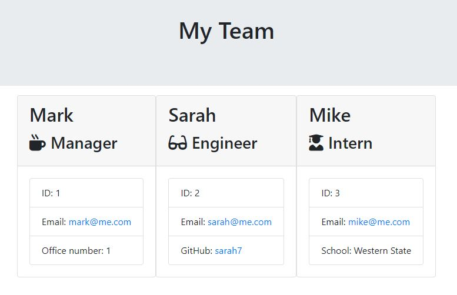
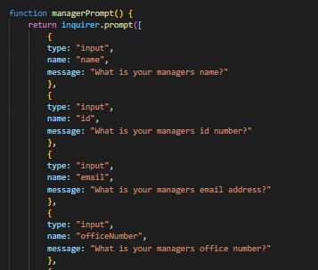
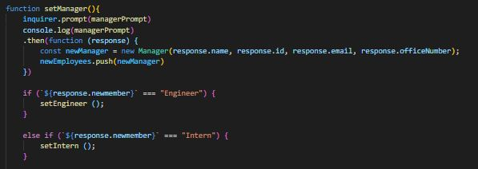

# employee_engine

=======

This Employee Engine allows user to create employee profiles directly in the terminal. It allows for different job types, and profile details based on user needs. 

## Table of Contents

* [Tech Used](#tech_used)
* [Usage](#usage)
* [Features](#features)
* [Deployed_Link](#deployed_link)
* [Author](#author)
* [Credits](#credits)
* [License](#license)

----

## Tech Used

* [HTML](https://developer.mozilla.org/en-US/docs/Web/HTML)
* [Javascript](https://developer.mozilla.org/en-US/docs/Web/JavaScript)
* [node.js](https://nodejs.org/en/)

## Usage
 
App accepts user input and creates employee profiles containing names, ID numbers, emails, and contact info. App utilizes node.js to build database directly in the terminal. Test cases are run with Jest to ensure correctly coded before deployed.

## Features

=======

-Flexible and can be customized to user needs. 

- Utilizes Inquirer prompts for user input.

- Functions to create new employee profiles based off user input.

- Creates employee profiles based off user input.

=======

## Deployed Link

* [See Live Site](https://ajhuff7.github.io/employee_engine/)

---

## Authors

**AJ Huff** 

- [Portfolio Site](#)
- [Github](https://github.com/ajhuff7)
- [LinkedIn](https://www.linkedin.com/in/aj-huff-7696b14b/)

## Credits

**Credit to my TAs, tutors, and classmates for much assistance!**

## License

 
=======
